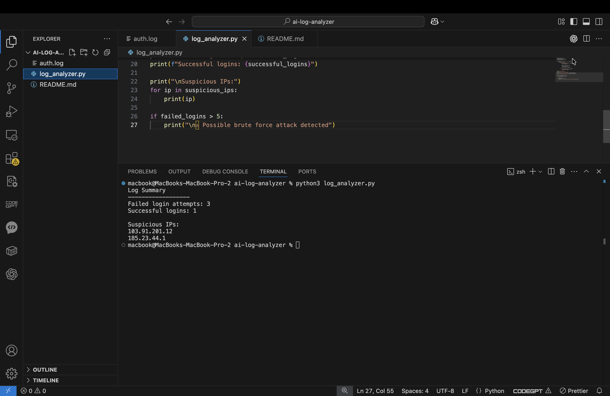
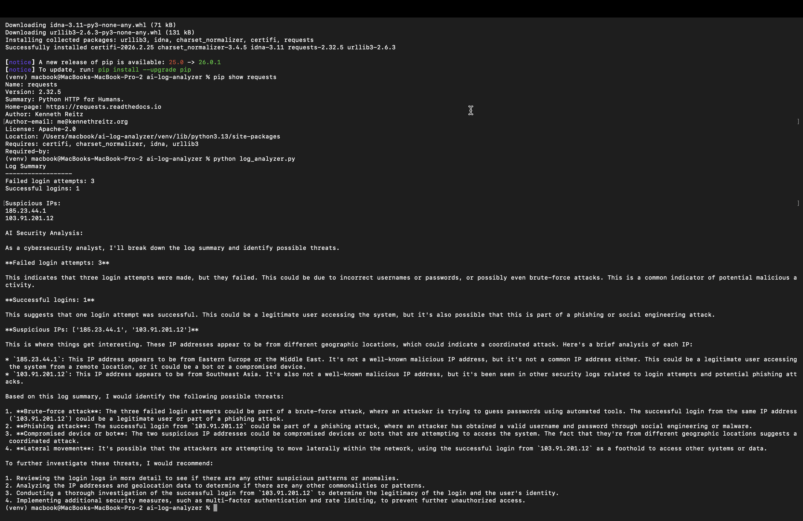

# AI Log Analyzer

A beginner cybersecurity project that analyzes Linux authentication logs and detects suspicious login activity such as failed login attempts and possible brute force attacks.

This project is part of my journey learning Security Operations (SOC), detection engineering, and security automation with Python.

---

# Project Overview

Security analysts constantly review authentication logs to detect malicious activity.

This tool automates part of that process by:

• scanning authentication logs  
• counting failed login attempts  
• identifying suspicious IP addresses  
• detecting possible brute force attacks  

It is a simple but realistic example of **security log analysis automation**.

---

# Technologies Used

- Python
- Basic log parsing
- Cybersecurity log analysis

Future improvements will include:

- AI-generated attack explanations
- automated alerting
- SIEM integration
- Requests library
- Local LLM via Ollama
- Log analysis automation

Why this matters:

Security analysts often review large amounts of logs.
AI-assisted analysis can help quickly summarize suspicious activity and highlight potential threats.

---

# Sample Log Data

Example authentication logs used for testing:
Mar 10 10:15:32 server sshd[1234]: Failed password for invalid user admin from 185.23.44.1 port 22 ssh2
Mar 10 10:16:01 server sshd[1234]: Failed password for invalid user admin from 185.23.44.1 port 22 ssh2
Mar 10 10:17:45 server sshd[1234]: Accepted password for user john from 192.168.1.10 port 22 ssh2
Mar 10 10:18:20 server sshd[1234]: Failed password for invalid user root from 103.91.201.12 port 22 ssh2

These logs simulate typical SSH authentication attempts on a Linux system.

---

# Script Explanation

The Python script performs the following steps:

1. Reads authentication logs from a file
2. Detects failed login attempts
3. Detects successful logins
4. Extracts IP addresses
5. Identifies suspicious behavior
6. Prints a summary report

This simulates a very basic **SOC log analysis workflow**.

---

# Example Output
Log Summary

Failed login attempts: 3
Successful logins: 1

Suspicious IPs:
185.23.44.1
103.91.201.12

Possible brute force activity detected

---

# Future Improvements

Planned features:

- AI log explanation using local LLM
- automatic threat scoring
- visualization dashboards
- integration with SIEM tools

---

# Author
@dzejkv

Learning cybersecurity, AI-assisted security analysis, and SOC engineering.

